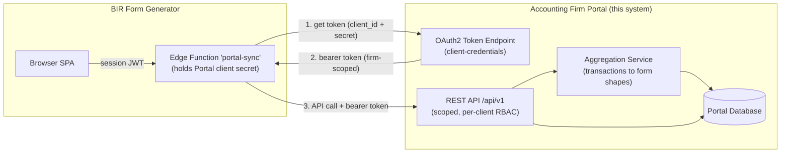
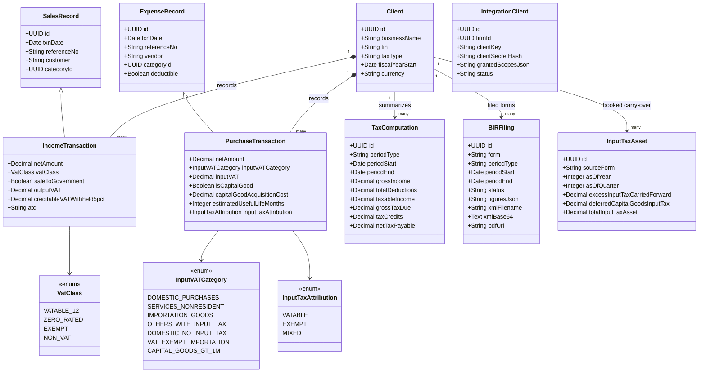
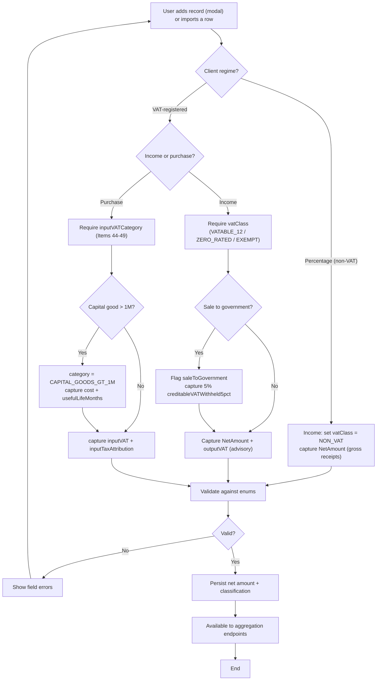
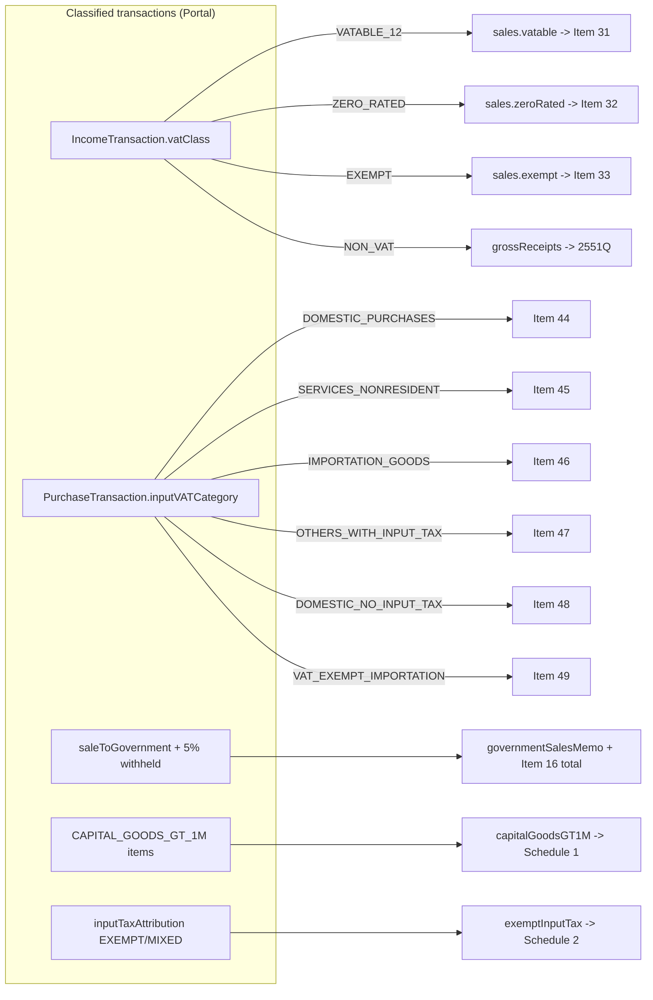
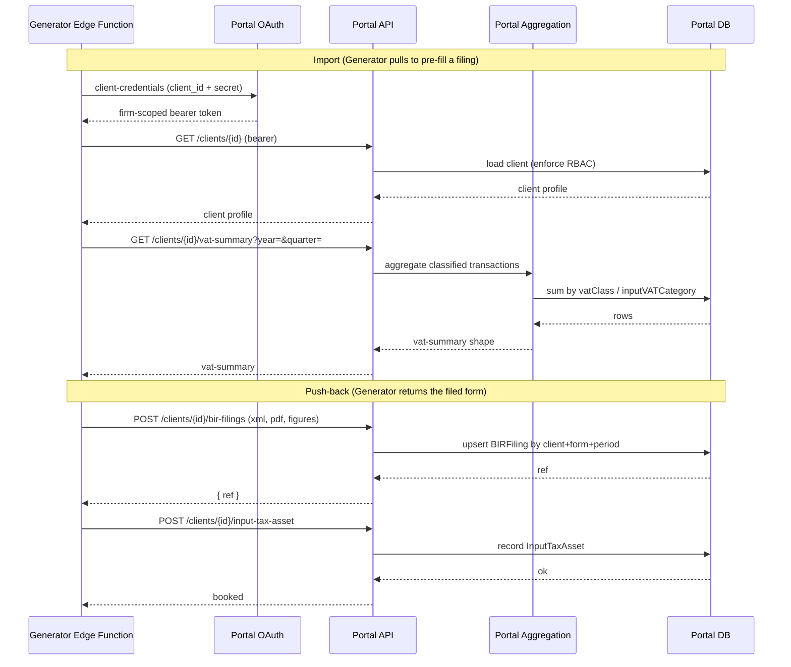

# Accounting Firm Portal ⇄ BIR Form Generator — Integration Specification

**Version 1.0 · July 6, 2026 · Draft for Review**

> **What this document is.** The BIR Form Generator's system design (§7) is written as a *build contract*
> that tells the **Accounting Firm Portal** what to implement. This document takes that contract and turns
> it into a concrete, Portal-side specification: it maps §7 onto the Portal domain model we already
> designed, identifies exactly what must be **added or changed**, and specifies the data model, APIs,
> authentication, and RBAC the Portal team must build so the two systems connect.

---

## Table of Contents

1. [How the Two Systems Fit Together](#1-how-the-two-systems-fit-together)
2. [Integration Architecture & Trust Boundary](#2-integration-architecture--trust-boundary)
3. [Gap Analysis — Current Portal Design vs. the §7 Contract](#3-gap-analysis--current-portal-design-vs-the-7-contract)
4. [Data Model Changes (Portal Side)](#4-data-model-changes-portal-side)
5. [Tax Classification at Capture — Impact on Entry & Import](#5-tax-classification-at-capture--impact-on-entry--import)
6. [APIs the Portal Must Expose (Portal → Generator)](#6-apis-the-portal-must-expose-portal--generator)
7. [APIs the Portal Must Accept (Generator → Portal)](#7-apis-the-portal-must-accept-generator--portal)
8. [Aggregation Logic — Transactions to Form Lines](#8-aggregation-logic--transactions-to-form-lines)
9. [Authentication, Authorization & RBAC Scopes](#9-authentication-authorization--rbac-scopes)
10. [End-to-End Sequence (Portal Perspective)](#10-end-to-end-sequence-portal-perspective)
11. [Sync Semantics & Portal Responsibilities](#11-sync-semantics--portal-responsibilities)
12. [Implementation Checklist & Phasing](#12-implementation-checklist--phasing)
13. [Appendix — Quick Reference](#13-appendix--quick-reference)

---

## 1. How the Two Systems Fit Together

The two systems are complementary and must not duplicate each other's authority.

- The **Accounting Firm Portal** is the **system of record** for clients and their **per-transaction**
  financial data. Under this integration it takes on one major new responsibility: it must **classify every
  income and purchase transaction for tax at the moment it is captured**, and expose **aggregation
  endpoints** that roll those transactions up into the exact shapes the BIR forms need.
- The **BIR Form Generator** is the **specialist producer** of official BIR forms and eBIRForms XML. It owns
  the **taxpayer registration** (tax types and the percentage-tax **ATC & rate**, sourced from the COR), the
  **period-to-period carry-overs** (excess input VAT, capital-goods amortization, prior payments), and it
  **pushes finished filings** — plus an **Input Tax Asset** figure — back to the Portal.

### 1.1 Responsibility Split

| Capability | Owner |
|---|---|
| Client profiles | **Accounting Firm Portal** |
| Per-transaction income & purchase records **+ tax classification** | **Accounting Firm Portal** |
| Aggregation endpoints — VAT summary, percentage receipts, income-tax summary | **Accounting Firm Portal** |
| Storing the filing artifact **and Input Tax Asset** on the client record | **Accounting Firm Portal** (values pushed by the Generator) |
| BIR form layout, field-level filling, form-specific rules | **BIR Form Generator** |
| Taxpayer registration — tax types + percentage-tax **ATC & rate** (from the COR) | **BIR Form Generator** |
| Period carry-overs — excess input VAT, capital-goods (>₱1M) amortization | **BIR Form Generator** |
| eBIRForms XML export & A4 PDF | **BIR Form Generator** |

### 1.2 One Rule That Prevents Conflict: the Portal *summarizes*, the Generator *computes the filing*

The Portal already has a configurable **Tax Computation** framework. Under this integration, that framework
is positioned as a **management estimate / summary**, **not** the authoritative BIR figure. The Generator
always **recomputes** using BIR rules (TRAIN tables, 8%, MCIT, OSD, NOLCO, VAT/percentage) and treats every
imported number as an *input to review*. This avoids two systems disagreeing on the "true" tax:

- **Portal → Generator:** the Portal's `TaxComputation` and transaction aggregates **pre-fill** a filing.
- **Generator → Portal:** the Generator's recomputed, filed figures come **back** as a `BIRFiling` record.

The Portal's own tax page therefore shows *its* estimate; the **filed** numbers displayed against a client
are the ones the Generator pushed back.

---

## 2. Integration Architecture & Trust Boundary

The Generator is a browser SPA, so **Portal credentials must never live in client code**. All Portal calls
route through a small **server-side connector** (a Supabase Edge Function, `portal-sync`) that holds the
Portal OAuth client secret and enforces the trust boundary. From the Portal's side, this means the Portal
exposes a **server-to-server REST API** authenticated with **OAuth2 client-credentials** — it never talks to
the browser directly.



**Portal-side obligations for the trust boundary:**

- Provide an **OAuth2 client-credentials** token endpoint. Issue a **firm-scoped** bearer token whose
  granted scopes are limited to those requested (see §9).
- Enforce the firm's existing **assigned-clients RBAC** on every call — the token identifies the firm, and
  the Portal still decides which clients are visible.
- Accept only the documented scopes; reject calls whose token lacks the scope for the endpoint.

---

## 3. Gap Analysis — Current Portal Design vs. the §7 Contract

This is the heart of the change. The table maps each §7 requirement to what the Portal design already has
and the action needed.

Legend:  ✅ **Have** (already in design)  ·  🔧 **Extend** (change existing)  ·  ➕ **New** (net-new)  ·  ⚙️ **Policy** (config/rule)

| # | §7 Requirement | In current Portal design? | Action |
|---|---|---|:---:|
| 1 | Client profile exposed & mappable to a Taxpayer | ✅ `Client` exists (businessName, tin, address, taxType, fiscalYearStart, currency, id) | ✅ expose read-only via API |
| 2 | Per-transaction **income** records with VAT/percentage tax classification | 🔧`SalesRecord` exists but lacks BIR tax fields | 🔧 extend → **`IncomeTransaction`** (§4.1) |
| 3 | Per-transaction **purchase** records with input-VAT categories & capital-goods data | 🔧`ExpenseRecord` exists but lacks BIR tax fields | 🔧 extend → **`PurchaseTransaction`** (§4.2) |
| 4 | Income-tax **summary** figures for a period | ✅ `TaxComputation` maps 1:1 (grossIncome, totalDeductions, taxableIncome, grossTaxDue, taxCredits, netTaxPayable, period) | ✅ expose via API |
| 5 | **`vat-summary`** aggregation endpoint (2550Q shape) | ➕ not present | ➕ build aggregation + endpoint (§6, §8) |
| 6 | **`percentage-tax-summary`** aggregation endpoint (2551Q shape) | ➕ not present | ➕ build aggregation + endpoint (§6, §8) |
| 7 | Raw classified transaction drill-down endpoints | ➕ not present | ➕ build read endpoints (§6) |
| 8 | Accept & store the **BIR filing artifact** (status + XML + PDF) | ➕ no such entity | ➕ new **`BIRFiling`** entity + endpoints (§4.3, §7) |
| 9 | Accept & book the **Input Tax Asset** carry-over | ➕ no such entity | ➕ new **`InputTaxAsset`** entity + endpoint (§4.4, §7) |
| 10 | Link records back to the originating client (`externalClientId`) | ✅ `Client.id` is the key the Generator stores | ✅ ensure `id` stability; key push-back by it |
| 11 | **OAuth2 client-credentials** server-to-server auth + scopes | ➕ Portal design assumed user auth only | ➕ add token endpoint + scope model (§9) |
| 12 | Capture VAT classification in **manual entry** and **import** | 🔧modal + CSV/XLSX templates exist, without BIR columns | 🔧 extend modal + templates (§5) |
| 13 | Idempotent push-back keyed by `client + form + period` | ➕ N/A | ➕ enforce upsert semantics (§11) |
| 14 | Do **not** own the percentage-tax ATC/rate; supply only amounts | ⚙ n/a | ⚙ policy: Portal returns gross receipts only (§8) |

**Reading of the gap:** the Portal's **core already aligns** — `Client` and `TaxComputation` map directly,
and RBAC/import/export exist. The real work is four net-new capabilities (**aggregation endpoints**,
**`BIRFiling`**, **`InputTaxAsset`**, **OAuth server-to-server**) plus two driver changes (**classify
transactions at capture** by extending Sales/Expense records and the entry/import surfaces).

---

## 4. Data Model Changes (Portal Side)

All BIR amounts are **exclusive of VAT (net)**; VAT is carried in its own fields. Enum values below are
reproduced **verbatim from the contract** so both teams stay byte-aligned.

### 4.1 Extend `SalesRecord` → `IncomeTransaction`

Add the BIR tax-classification fields to the Portal's existing sales record.

| New / changed field | Type | Meaning |
|---|---|---|
| `netAmount` | Decimal | Sale amount **net of VAT** (replaces reliance on gross `amount`). |
| `vatClass` | enum `VatClass` | `VATABLE_12` · `ZERO_RATED` · `EXEMPT` · `NON_VAT`. Drives 2550Q Items 31/32/33 (or 2551Q gross receipts when `NON_VAT`). |
| `saleToGovernment` | Boolean | Overlay flag — the sale is **also** `VATABLE_12`; triggers the 5% creditable VAT withheld. |
| `outputVAT` | Decimal | Advisory (Generator derives Item 31B = 12% × net). |
| `creditableVATWithheld5pct` | Decimal | 5% VAT withheld on government sales → memo to Item 16. |
| `atc` | String (optional) | Percentage-tax ATC — populate **only** if a client has multiple percentage-tax streams (otherwise the Generator's taxpayer profile is authoritative). |

### 4.2 Extend `ExpenseRecord` → `PurchaseTransaction`

| New / changed field | Type | Meaning |
|---|---|---|
| `netAmount` | Decimal | Purchase amount **net of VAT**. |
| `inputVATCategory` | enum `InputVATCategory` | `DOMESTIC_PURCHASES` · `SERVICES_NONRESIDENT` · `IMPORTATION_GOODS` · `OTHERS_WITH_INPUT_TAX` · `DOMESTIC_NO_INPUT_TAX` · `VAT_EXEMPT_IMPORTATION` · `CAPITAL_GOODS_GT_1M`. Maps to 2550Q Items 44–49 / Schedule 1. |
| `inputVAT` | Decimal | Input VAT for the purchase (0 for no-input-tax categories). |
| `isCapitalGood` | Boolean | Marks a capital acquisition. |
| `capitalGoodAcquisitionCost` | Decimal | Required when `inputVATCategory = CAPITAL_GOODS_GT_1M`. |
| `estimatedUsefulLifeMonths` | Integer | Amortization life for capital goods > ₱1M (Schedule 1). |
| `inputTaxAttribution` | enum `InputTaxAttribution` | `VATABLE` · `EXEMPT` · `MIXED`. Drives Schedule 2 (directly-attributable vs common input tax). |
| `deductible` | Boolean | Retained from `ExpenseRecord` (income-tax deductibility). |

> Capital goods **≤ ₱1M** are treated as `DOMESTIC_PURCHASES` and claimed in full (Item 44). Only
> **> ₱1M** capital goods use `CAPITAL_GOODS_GT_1M` and feed Schedule 1 amortization, which the
> **Generator** computes — the Portal only stores the acquisition cost, input VAT, and useful life.

### 4.3 New Entity — `BIRFiling` (push-back artifact)

Stores what the Generator pushes back so the client record shows filed BIR forms.

| Field | Type | Meaning |
|---|---|---|
| `id` / `ref` | UUID | Portal reference returned to the Generator. |
| `clientId` | UUID | Owning client. |
| `form` | String | e.g. `2550Q`, `1701Q`, `1702RT`. |
| `periodType` | String | `quarter` / `year`. |
| `periodStart` / `periodEnd` | Date | Filing period. |
| `status` | String | `draft` / `ready` / `filed`. |
| `figures` | JSON | Key figures (e.g. outputVAT, allowableInputVAT, netVATPayable, amountPayable). |
| `xmlFilename` | String | eBIRForms XML filename. |
| `xmlBase64` | Text/BLOB | The stored eBIRForms XML. |
| `pdfUrl` | String | Signed URL / stored A4 PDF. |
| `createdAt` / `updatedAt` | DateTime | Audit timestamps. |

**Uniqueness:** one logical filing per `(clientId, form, periodStart, periodEnd)` — re-sends **update** it.

### 4.4 New Entity — `InputTaxAsset` (booked carry-over)

Lets the Portal book the input VAT the Generator carries forward as a balance-sheet **asset**.

| Field | Type | Meaning |
|---|---|---|
| `id` | UUID | Identifier. |
| `clientId` | UUID | Owning client. |
| `sourceForm` | String | e.g. `2550Q`. |
| `asOfYear` / `asOfQuarter` | Integer | Period the carry-over is measured at. |
| `excessInputTaxCarriedForward` | Decimal | Excess creditable input VAT. |
| `deferredCapitalGoodsInputTax` | Decimal | Unamortized capital-goods input tax. |
| `totalInputTaxAsset` | Decimal | Sum booked as an asset. |
| `computedAt` | DateTime | When the Generator computed it. |

> **Ownership:** the **Generator** is the source of truth for the carry-over math; the Portal only
> **records** the amount so it appears on the books.

### 4.5 New — `IntegrationClient` (OAuth server-to-server)

| Field | Type | Meaning |
|---|---|---|
| `id` | UUID | Identifier. |
| `firmId` | UUID | Firm the credentials belong to. |
| `clientKey` | String | OAuth `client_id`. |
| `clientSecretHash` | String | Hashed secret (never stored in plaintext). |
| `grantedScopes` | String[] | Subset of the scopes in §9. |
| `status` | String | `active` / `revoked`. |
| `lastUsedAt` | DateTime | Telemetry. |

Managed by a **Firm Administrator** in Portal settings (see §9).

### 4.6 Updated Portal Domain — Integration View



---

## 5. Tax Classification at Capture — Impact on Entry & Import

The single most important behavioural change: **every income and purchase transaction must be classified
for VAT/percentage tax at the moment it is recorded.** Aggregation cannot infer `vatClass` or
`inputVATCategory` after the fact, so both the **manual entry modal** and the **CSV/XLSX import templates**
from the Portal's original design must be extended.

### 5.1 Updated Sales / Income Import Template

The Portal's original Sales template gains the BIR columns (new columns marked **★**). Amounts are net of VAT.

| Column | Required | Type | Notes |
|---|:---:|---|---|
| `Date` | ✔ | Date | Transaction date. |
| `ReferenceNo` | ✖ | Text | Invoice / OR number. |
| `Customer` | ✖ | Text | Payer. |
| `Description` | ✔ | Text | What the income is for. |
| `Category` | ✔ | Text | Income category. |
| `NetAmount` ★ | ✔ | Decimal | Amount **exclusive of VAT**. |
| `VatClass` ★ | ✔ (VAT clients) | Enum | `VATABLE_12` / `ZERO_RATED` / `EXEMPT` / `NON_VAT`. |
| `OutputVAT` ★ | ✖ | Decimal | Advisory; Generator derives 12% × net. |
| `SaleToGovernment` ★ | ✖ | `Yes`/`No` | Overlay on a vatable sale. |
| `CreditableVATWithheld5pct` ★ | ✖ | Decimal | 5% withheld on government sales. |
| `ATC` ★ | ✖ | Text | Only if multiple percentage-tax streams. |
| `Currency` | ✖ | ISO | Defaults to client currency. |

### 5.2 Updated Expenses / Purchases Import Template

| Column | Required | Type | Notes |
|---|:---:|---|---|
| `Date` | ✔ | Date | Transaction date. |
| `ReferenceNo` | ✖ | Text | Receipt / bill number. |
| `Vendor` | ✖ | Text | Supplier. |
| `Description` | ✔ | Text | What the expense is for. |
| `Category` | ✔ | Text | Expense category. |
| `NetAmount` ★ | ✔ | Decimal | Amount **exclusive of VAT**. |
| `InputVATCategory` ★ | ✔ (VAT clients) | Enum | Items 44–49 / Schedule 1 category. |
| `InputVAT` ★ | ✖ | Decimal | Input VAT (0 for no-input categories). |
| `IsCapitalGood` ★ | ✖ | `Yes`/`No` | Capital acquisition flag. |
| `CapitalGoodAcquisitionCost` ★ | cond. | Decimal | Required if `CAPITAL_GOODS_GT_1M`. |
| `EstimatedUsefulLifeMonths` ★ | cond. | Integer | Required if `CAPITAL_GOODS_GT_1M`. |
| `InputTaxAttribution` ★ | ✖ | Enum | `VATABLE` / `EXEMPT` / `MIXED`. |
| `Deductible` | ✖ | `Yes`/`No` | Income-tax deductibility (default from category). |
| `Currency` | ✖ | ISO | Defaults to client currency. |

### 5.3 Manual Entry (Modal) Additions

The add/edit modal becomes **regime-aware**, driven by whether the client is VAT-registered or
percentage-tax (a client is *either/or*):

- **VAT client, income:** show `VatClass` (required), plus a `SaleToGovernment` toggle that reveals the 5%
  withheld field. `NetAmount` replaces the old gross amount.
- **VAT client, purchase:** show `InputVATCategory` (required) and `InputVAT`; selecting `CAPITAL_GOODS_GT_1M`
  reveals `CapitalGoodAcquisitionCost` and `EstimatedUsefulLifeMonths`; show `InputTaxAttribution`.
- **Percentage-tax client, income:** `VatClass` is fixed to `NON_VAT`; only `NetAmount` (gross receipts)
  matters. The **ATC/rate are not asked** — they live on the Generator's taxpayer profile.

Validation mirrors the enums so imports and manual entries produce identically-shaped data.

### 5.4 Activity — Capture-Time Tax Classification



---

## 6. APIs the Portal Must Expose (Portal → Generator)

Base: `{PORTAL_BASE}/api/v1`. All calls arrive via the Generator's `portal-sync` Edge Function carrying an
**OAuth2 bearer token**; the Portal enforces per-client RBAC on every request.

| Method & Path | Purpose | Scope |
|---|---|---|
| `GET /clients?assignedTo=me&query=` | List/select importable clients | `clients:read` |
| `GET /clients/{clientId}` | One client profile → Taxpayer mapping | `clients:read` |
| `GET /clients/{clientId}/tax-computations?periodType=&periodStart=&periodEnd=` | Income-tax **summary** figures | `tax-computations:read` |
| `GET /clients/{clientId}/vat-summary?year=&quarter=` | 2550Q roll-up of classified transactions | `vat-summary:read` |
| `GET /clients/{clientId}/percentage-tax-summary?year=&quarter=` | 2551Q gross receipts (per ATC if any) | `percentage-tax-summary:read` |
| `GET /clients/{clientId}/income-transactions?from=&to=` | Raw classified income rows (drill-down) | `transactions:read` |
| `GET /clients/{clientId}/purchase-transactions?from=&to=` | Raw classified purchase rows (drill-down) | `transactions:read` |

### 6.1 `vat-summary` Response Contract

Keys map to the actual April-2024 2550Q lines. All `net` amounts are exclusive of VAT. Government sales are
**not** a separate output line — they are included in `sales.vatable` and additionally carry a memo:

```json
{
  "client": { "id": "cl_123", "tin": "471522378", "vatRegistered": true },
  "period": { "year": 2026, "quarter": 1, "start": "2026-01-01", "end": "2026-03-31" },
  "sales": {
    "vatable":   { "net": 400000.00, "outputVAT": 48000.00 },
    "zeroRated": { "net": 0.00 },
    "exempt":    { "net": 0.00 },
    "governmentSalesMemo": { "net": 100000.00, "creditableVATWithheld5pct": 5000.00 }
  },
  "purchases": {
    "domesticPurchases":   { "net": 300000.00, "inputVAT": 36000.00 },
    "servicesNonResident": { "net": 0.00, "inputVAT": 0.00 },
    "importationGoods":    { "net": 0.00, "inputVAT": 0.00 },
    "othersWithInputTax":  { "net": 0.00, "inputVAT": 0.00 },
    "domesticNoInputTax":  { "net": 0.00 },
    "vatExemptImportation":{ "net": 0.00 },
    "capitalGoodsGT1M": {
      "items": [ { "acquiredOn": "2026-02-10", "cost": 1500000.00, "inputVAT": 180000.00, "usefulLifeMonths": 60 } ]
    }
  },
  "exemptInputTax": {
    "directlyAttributable": 0.00,
    "commonNotDirectlyAttributable": 0.00
  },
  "otherCredits": {
    "creditableVATWithheld": 5000.00,
    "advanceVATPayments": 0.00
  }
}
```

**Portal rules the aggregation must obey:**

- `sales.vatable.outputVAT` is **advisory** — the Generator recomputes Item 31B as 12% × net.
- `otherCredits.creditableVATWithheld` is the **single total** for Item 16 and **already includes** the
  government 5% in `governmentSalesMemo` — do **not** double-count.
- `exemptInputTax` returns the two Schedule-2 components (directly-attributable + common pool); the Portal
  does **not** pre-apportion — the Generator computes the ratable exempt share from total sales.
- `capitalGoodsGT1M` returns raw acquisition items; **amortization is the Generator's job**.

### 6.2 `percentage-tax-summary` Response Contract

```json
{
  "client": { "id": "cl_123", "tin": "471522378", "vatRegistered": false },
  "period": { "year": 2026, "quarter": 1, "start": "2026-01-01", "end": "2026-03-31" },
  "grossReceipts": 500000.00,
  "byAtc": [ { "atc": "PT010", "grossReceipts": 500000.00 } ]
}
```

- `byAtc` is **optional** — populate only when a client genuinely has multiple percentage-tax streams.
- The Portal returns **amounts only**. The **ATC is authoritative on the Generator's taxpayer profile** and
  the **rate is resolved by the Generator's period-keyed catalog** — the Portal must not send a rate.
- Creditable percentage-tax-withheld (Item 15) is **intentionally omitted** (stays manual in the Generator).

---

## 7. APIs the Portal Must Accept (Generator → Portal)

| Method & Path | Purpose | Scope |
|---|---|---|
| `POST /clients/{clientId}/bir-filings` | Create the BIR filing artifact (idempotent by `client + form + period`) | `bir-filings:write` |
| `PUT /clients/{clientId}/bir-filings/{ref}` | Re-sync the same period (update in place) | `bir-filings:write` |
| `POST /clients/{clientId}/input-tax-asset` | Book the Input Tax Asset carry-over | `input-tax-asset:write` |
| `GET /clients/{clientId}/bir-filings` | Optional: reconcile what the Portal holds | `bir-filings:read` |

### 7.1 `bir-filings` Push-Back Payload

```json
{
  "form": "2550Q",
  "periodType": "quarter",
  "periodStart": "2026-01-01",
  "periodEnd": "2026-03-31",
  "status": "filed",
  "figures": { "outputVAT": 48000.00, "allowableInputVAT": 60000.00, "netVATPayable": -12000.00, "amountPayable": 0.00 },
  "xmlFilename": "471522378000002550Q2026Q1.xml",
  "xmlBase64": "<base64 of the eBIRForms XML>",
  "pdfUrl": "https://<signed-url-to-A4-pdf>"
}
```

> In this **excess-input quarter**, input (60,000) exceeds output (48,000), so `netVATPayable` is negative
> (−12,000) and nothing is payable; the 12,000 is carried forward and handed off below.

**Portal behaviour on receipt:** upsert the `BIRFiling` keyed by `(clientId, form, periodStart, periodEnd)`;
store the XML and PDF; return the Portal `ref`. Surface the filing on the client's profile.

### 7.2 `input-tax-asset` Handoff Payload

```json
{
  "sourceForm": "2550Q",
  "asOfPeriod": { "year": 2026, "quarter": 1 },
  "excessInputTaxCarriedForward": 12000.00,
  "deferredCapitalGoodsInputTax": 3000.00,
  "totalInputTaxAsset": 15000.00,
  "computedAt": "2026-04-20T09:00:00Z"
}
```

**Portal behaviour on receipt:** record an `InputTaxAsset` against the client for the period so the
carried-forward input VAT (12,000 excess + 3,000 deferred capital-goods = 15,000) appears on the books. The
Portal **records** this value; it does **not** compute it.

---

## 8. Aggregation Logic — Transactions to Form Lines

The Portal's aggregation service turns classified transactions into the `vat-summary` /
`percentage-tax-summary` shapes. The mapping is deterministic:



**Aggregation rules to implement:**

1. **Sum `netAmount` by `vatClass`** for income in the period → `sales.vatable/zeroRated/exempt.net`.
   Vatable `outputVAT` is summed as advisory only.
2. **Government sales:** rows with `saleToGovernment = true` are counted **inside** `sales.vatable` and
   also totalled into `governmentSalesMemo`; their 5% withheld feeds the **single** `creditableVATWithheld`
   total (Item 16) — counted once.
3. **Sum `netAmount` and `inputVAT` by `inputVATCategory`** for purchases → the Items 44–49 buckets.
   `DOMESTIC_NO_INPUT_TAX` and `VAT_EXEMPT_IMPORTATION` return **amount only** (no input VAT).
4. **Capital goods > ₱1M** are emitted as **raw acquisition items** (cost, input VAT, useful life) under
   `capitalGoodsGT1M.items` — never rolled into Items 44–49.
5. **Exempt input tax:** total the directly-attributable amount and the common (mixed) pool separately;
   **do not apportion**.
6. **Percentage clients:** sum `netAmount` of `NON_VAT` income into `grossReceipts` (and `byAtc` when the
   client has multiple ATC streams). No rate is applied.

> These are pure summations over already-classified rows — which is exactly why classification must happen
> at capture (§5).

---

## 9. Authentication, Authorization & RBAC Scopes

### 9.1 Server-to-Server Auth

The Portal exposes an **OAuth2 client-credentials** flow. The Generator's Edge Function exchanges its
`client_id` + secret for a **firm-scoped bearer token**; the Portal validates the token and the requested
scopes on each call, then applies the firm's **assigned-clients RBAC** to decide which clients are visible.

**Scopes** (grant only what the connector needs):

| Scope | Grants |
|---|---|
| `clients:read` | List and read client profiles |
| `tax-computations:read` | Read income-tax summary figures |
| `vat-summary:read` | Read the 2550Q aggregate |
| `percentage-tax-summary:read` | Read the 2551Q aggregate |
| `transactions:read` | Read raw classified income/purchase rows |
| `bir-filings:read` | Read stored filings (reconciliation) |
| `bir-filings:write` | Create/update the filing artifact |
| `input-tax-asset:write` | Book the Input Tax Asset |

### 9.2 Mapping onto the Portal's Existing RBAC

The integration adds a small **Integration/API** permission group to the roles defined in the Portal design:

| Capability | Super Admin | Manager | Accountant | Staff | Client users |
|---|:---:|:---:|:---:|:---:|:---:|
| Manage integration credentials (`IntegrationClient`) | ● | ○ | ○ | ○ | ○ |
| Trigger import from Portal / push-back (via Generator) | ● | ◐ | ◐ | ○ | ○ |
| View pushed-back `BIRFiling` on a client | ● | ◐ | ◐ | ◐ | view own |
| Classify transactions at capture (new required fields) | ● | ◐ | ◐ | ◐ | ◐* |

*Client-side entry only if the firm enables it. ● full · ◐ assigned-clients only · ○ none.

> The bearer token acts **on behalf of the firm**, not a single user; the Portal's per-client visibility
> rules still bound what any token can reach.

---

## 10. End-to-End Sequence (Portal Perspective)



---

## 11. Sync Semantics & Portal Responsibilities

| Concern | Portal responsibility |
|---|---|
| **Idempotency** | Treat push-back as an **upsert** keyed by `client + form + period`; never duplicate a filing on re-send. |
| **Partial data** | If no aggregate exists for a period, still serve the client profile so the Generator can pre-fill background and let the practitioner enter figures. |
| **Reconciliation** | Return figures as data; expect the Generator to recompute — the Portal's numbers are inputs, not the filed truth. |
| **Carry-over ownership** | Only **record** the Input Tax Asset handed back; do not compute carry-over or amortization. |
| **Failure** | Return clear, retryable errors; the Generator marks the push pending and retries — remain consistent under retries (idempotency). |
| **Auth expiry** | Reject expired tokens cleanly so the Edge Function can refresh via client-credentials. |
| **Least privilege** | Honour scope boundaries; enforce per-client visibility regardless of token scope. |

---

## 12. Implementation Checklist & Phasing

**Phase 1 — Data model & capture (foundation)**

- [ ] Extend `SalesRecord` → `IncomeTransaction` fields (§4.1).
- [ ] Extend `ExpenseRecord` → `PurchaseTransaction` fields (§4.2).
- [ ] Make the entry **modal regime-aware**; add the new required fields (§5.3).
- [ ] Update **CSV/XLSX import templates** + validation to the new columns (§5.1–5.2).
- [ ] Backfill/migration plan for existing records (default classification + review queue).

**Phase 2 — Read APIs (enable import)**

- [ ] `GET /clients` and `GET /clients/{id}` (profile → Taxpayer mapping).
- [ ] `GET /clients/{id}/tax-computations` (already-modelled summary).
- [ ] Build the **aggregation service** and `vat-summary` + `percentage-tax-summary` (§6, §8).
- [ ] `income-transactions` / `purchase-transactions` drill-down endpoints.

**Phase 3 — Write APIs (enable push-back)**

- [ ] New `BIRFiling` entity + `POST`/`PUT`/`GET /clients/{id}/bir-filings` with idempotent upsert (§7).
- [ ] New `InputTaxAsset` entity + `POST /clients/{id}/input-tax-asset` (§7.2).
- [ ] Surface pushed-back filings and Input Tax Asset on the client profile.

**Phase 4 — Auth, RBAC & hardening**

- [ ] OAuth2 client-credentials token endpoint + scope enforcement (§9).
- [ ] `IntegrationClient` management screen for Firm Admins.
- [ ] Add the Integration/API permission group to roles (§9.2).
- [ ] Idempotency, retry-safety, and audit logging on all integration endpoints.

---

## 13. Appendix — Quick Reference

### 13.1 Endpoint Summary

| Direction | Endpoint | Scope |
|---|---|---|
| Portal → Gen | `GET /clients` | `clients:read` |
| Portal → Gen | `GET /clients/{id}` | `clients:read` |
| Portal → Gen | `GET /clients/{id}/tax-computations` | `tax-computations:read` |
| Portal → Gen | `GET /clients/{id}/vat-summary` | `vat-summary:read` |
| Portal → Gen | `GET /clients/{id}/percentage-tax-summary` | `percentage-tax-summary:read` |
| Portal → Gen | `GET /clients/{id}/income-transactions` | `transactions:read` |
| Portal → Gen | `GET /clients/{id}/purchase-transactions` | `transactions:read` |
| Gen → Portal | `POST /clients/{id}/bir-filings` | `bir-filings:write` |
| Gen → Portal | `PUT /clients/{id}/bir-filings/{ref}` | `bir-filings:write` |
| Gen → Portal | `GET /clients/{id}/bir-filings` | `bir-filings:read` |
| Gen → Portal | `POST /clients/{id}/input-tax-asset` | `input-tax-asset:write` |

### 13.2 Enum Reference

| Enum | Values |
|---|---|
| `VatClass` | `VATABLE_12`, `ZERO_RATED`, `EXEMPT`, `NON_VAT` |
| `InputVATCategory` | `DOMESTIC_PURCHASES`, `SERVICES_NONRESIDENT`, `IMPORTATION_GOODS`, `OTHERS_WITH_INPUT_TAX`, `DOMESTIC_NO_INPUT_TAX`, `VAT_EXEMPT_IMPORTATION`, `CAPITAL_GOODS_GT_1M` |
| `InputTaxAttribution` | `VATABLE`, `EXEMPT`, `MIXED` |

### 13.3 Ownership at a Glance

| The Portal owns | The Generator owns |
|---|---|
| Client profiles; classified transactions; aggregation; storing `BIRFiling` + `InputTaxAsset` | Taxpayer registration (tax types, ATC & **rate**); form layout & rules; carry-overs & amortization; eBIRForms XML & PDF |

### 13.4 Forms Covered by This Integration

| Form | Import source | Status |
|---|---|---|
| 2550Q (VAT) | `vat-summary` (+ Generator carry-over) | ✅ in scope |
| 2551Q (Percentage) | `percentage-tax-summary` (+ Generator ATC/rate) | ✅ in scope |
| 1701 / 1701A / 1701Q / 1702RT / 1702Q (Income tax) | `tax-computations` (+ manual NOLCO/MCIT/method) | ✅ in scope |
| 2307 / 2316 (Certificates) | Standalone in Generator | ✖ out of API scope |

---

*End of document.*
