# Accounting Firm Portal — System Design Document

**Version 2.0 · July 6, 2026 · Draft for Review**

> **What changed in v2.** This edition folds the **BIR Form Generator integration** into the core design
> (context, requirements, actors, RBAC, use cases, domain model, activity flows, import templates, and a
> dedicated integration section) and adds a full **Technology Stack** (§5).

---

## Table of Contents

1. [Introduction & Scope](#1-introduction--scope)
2. [System Requirements](#2-system-requirements)
3. [System Actors](#3-system-actors)
4. [Roles & RBAC Model](#4-roles--rbac-model)
5. [Technology Stack](#5-technology-stack)
6. [Top Use Cases](#6-top-use-cases)
7. [Class Diagram (Domain Model)](#7-class-diagram-domain-model)
8. [Activity Diagrams](#8-activity-diagrams)
9. [Import / Export Templates](#9-import--export-templates)
10. [Tax Computation Framework](#10-tax-computation-framework)
11. [BIR Form Generator Integration](#11-bir-form-generator-integration)
12. [Appendices](#12-appendices)

---

## 1. Introduction & Scope

### 1.1 Purpose

The **Accounting Firm Portal** is a multi-tenant web application that lets an accounting firm centrally
manage its **clients**, store and process each client's **sales/income** and **expenses**, compute
**taxes**, and give each client self-service visibility through a dedicated **Client Portal**.

The platform combines five capabilities in one system:

- **Client & data management** — one profile per client, holding all business information and financial records.
- **Role-Based Access Control (RBAC)** — configurable roles for both firm staff and client staff.
- **Communications** — send billing/invoices and portal invitations by email from inside the app.
- **Financial processing** — import/export (CSV & XLSX), manual entry, and a configurable tax-computation engine.
- **BIR Form Generator integration** — classify transactions for Philippine tax at capture, serve
  aggregated figures to the **BIR Form Generator**, and record the finished BIR filings it pushes back.

### 1.2 Scope

**In scope:** client profiles and per-client data isolation; firm and client users with RBAC; sales/income
and expense records (manual + CSV/XLSX import/export); email (billing + invitations); a configurable tax
framework; the Client Portal; and the **BIR Form Generator integration** — capture-time tax classification,
aggregation endpoints, and receipt of pushed-back filings and the Input Tax Asset.

**Out of scope:** producing BIR form layouts / eBIRForms XML and doing the authoritative BIR tax math
(**owned by the BIR Form Generator**); direct e-filing to the BIR; payment processing; and a full
double-entry general ledger.

### 1.3 Key Concepts & Tenancy Model

| Concept | Description |
|---|---|
| **Firm** | The accounting firm that owns and operates the portal (the top-level tenant owner). |
| **Firm User** | A member of the firm's staff (e.g., admin, accountant, bookkeeper). |
| **Client** | A business/organization served by the firm. Each client is an isolated data tenant. |
| **Client User** | A member of a client's staff who accesses the Client Portal (minimum **3 seats** per client). |
| **Financial Record** | A sales/income or expense transaction belonging to exactly one client, **classified for tax at capture**. |
| **BIR Form Generator** | An external, complementary system that produces official BIR forms and eBIRForms XML from data pulled out of this Portal. |

### 1.4 How the Portal Relates to the BIR Form Generator

The two systems are complementary and must not duplicate authority:

- The **Portal** is the **system of record** for clients and their **per-transaction** data. It classifies
  each transaction for tax at capture and exposes **aggregation endpoints** that roll transactions into the
  shapes BIR forms need.
- The **BIR Form Generator** is the **specialist producer** of BIR forms. It owns taxpayer registration
  (tax types, percentage-tax ATC & rate from the COR), period carry-overs, form rules, and the eBIRForms
  XML/PDF. It **pulls** figures from the Portal to pre-fill a filing and **pushes** the finished filing —
  plus an **Input Tax Asset** figure — back.

A single rule prevents conflict: **the Portal *summarizes*, the Generator *computes the filing*.** The
Portal's tax framework (§10) is a management estimate; the **filed** numbers shown on a client come from the
Generator's push-back (§11).

### 1.5 High-Level System Context

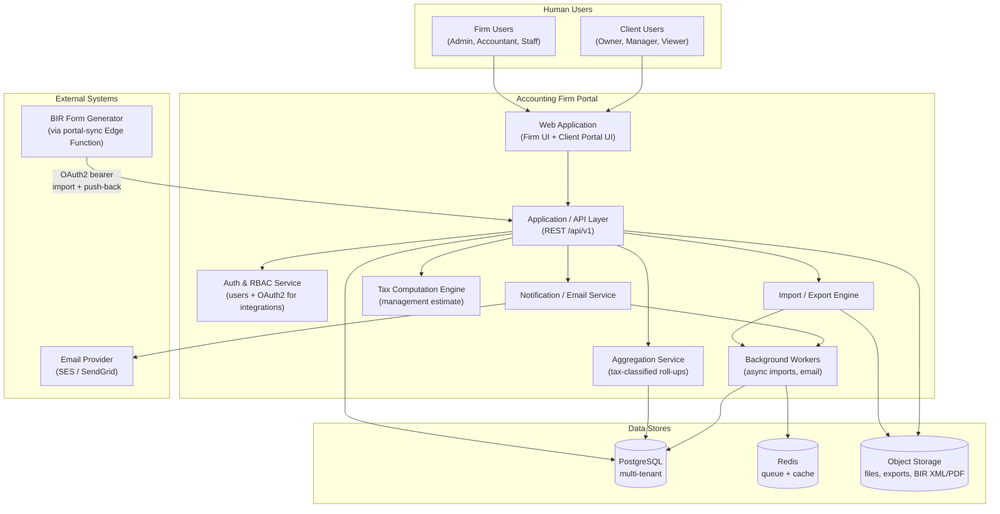

---

## 2. System Requirements

Requirements are split into **Functional (FR)** — what the system must do — and **Non-Functional (NFR)** —
how well it must do it.

### 2.1 Functional Requirements

#### Authentication & User Management

| ID | Requirement |
|---|---|
| FR-01 | The system shall authenticate users via email + password, with support for Multi-Factor Authentication (MFA). |
| FR-02 | The system shall implement Role-Based Access Control (RBAC) with configurable roles and granular permissions. |
| FR-03 | Firm administrators shall be able to create, update, deactivate, and delete portal users. |
| FR-04 | The system shall support inviting users by email with a secure, single-use, expiring activation link. |
| FR-05 | The system shall enforce scoped access — firm users only access assigned clients; client users only their own organization. |

#### Client Management

| ID | Requirement |
|---|---|
| FR-06 | Firm users shall create and maintain client profiles (business name, TIN/registration no., address, contacts, tax type, fiscal year, currency). |
| FR-07 | Each client's data shall be stored with strict tenant isolation. |
| FR-08 | Each client profile shall present a dashboard summarizing income, expenses, tax position, and **filed BIR forms**. |

#### Sales & Expense Management (with tax classification)

| ID | Requirement |
|---|---|
| FR-09 | The system shall record client **sales/income** transactions and **classify each for tax at capture** (VAT class / percentage). |
| FR-10 | The system shall record client **expense/purchase** transactions and **classify each for input-VAT treatment at capture**. |
| FR-11 | Users shall be able to add a record **manually via a regime-aware modal** form. |
| FR-12 | The system shall support **bulk import** of sales/expenses from **CSV** and **XLSX** following the defined template (incl. tax-classification columns). |
| FR-13 | The system shall **validate** imported data (incl. enum classifications) and report row-level errors before committing. |
| FR-14 | The system shall support **export** of sales/expenses to **CSV** and **XLSX**. |
| FR-15 | The system shall categorize transactions to drive reporting, deductibility, and tax treatment. |

#### Client Portal

| ID | Requirement |
|---|---|
| FR-16 | The system shall provide a **Client Portal** giving client users visibility into their own sales/income, expenses, and filed BIR forms. |
| FR-17 | Each client organization shall support a **minimum of 3 users** (configurable seat limit). |
| FR-18 | Client users shall have **role-based visibility** (Owner, Manager, Viewer). |

#### Email & Notifications

| ID | Requirement |
|---|---|
| FR-19 | The system shall send **billing/invoice** emails to clients from within the app. |
| FR-20 | The system shall send **portal invitation** emails to client users. |
| FR-21 | The system shall log every email sent, with delivery status, and provide reusable **templates**. |

#### Tax Computation (management estimate)

| ID | Requirement |
|---|---|
| FR-22 | The system shall compute a tax **estimate** from a client's sales/expenses using a configurable framework. |
| FR-23 | Each client profile shall include a **Tax Computation page** (gross income, deductions, taxable income, tax due) for a period. |
| FR-24 | The system shall treat its computation as an estimate; the **authoritative filed figures** come from the BIR Form Generator (§11). |

#### BIR Form Generator Integration

| ID | Requirement |
|---|---|
| FR-25 | The system shall expose a **read API** for client profiles and income-tax **summary** figures (`TaxComputation`). |
| FR-26 | The system shall expose **aggregation endpoints** that roll classified transactions into **VAT (2550Q)** and **percentage-tax (2551Q)** shapes. |
| FR-27 | The system shall expose **drill-down endpoints** for raw classified income/purchase rows. |
| FR-28 | The system shall **accept and store** the BIR filing artifact (form, period, status, eBIRForms XML, PDF) pushed back by the Generator, idempotent by client + form + period. |
| FR-29 | The system shall **accept and record** the **Input Tax Asset** carry-over pushed back by the Generator. |
| FR-30 | The system shall authenticate integration calls via **OAuth2 client-credentials** with scoped tokens, enforcing per-client RBAC. |

#### Reporting & Audit

| ID | Requirement |
|---|---|
| FR-31 | The system shall produce financial summary reports (income-statement style) per client and period. |
| FR-32 | The system shall maintain an **audit trail** of key actions (create/update/delete, imports, exports, emails, logins, integration calls). |

### 2.2 Non-Functional Requirements

| ID | Category | Requirement |
|---|---|---|
| NFR-01 | Security | TLS 1.2+ in transit; passwords hashed (argon2/bcrypt); MFA; least-privilege RBAC; OAuth scopes enforced; secrets in a managed vault. |
| NFR-02 | Privacy & Compliance | Per-client data isolation; immutable audit logs; data-retention policy; alignment with the PH Data Privacy Act 2012 / GDPR-equivalent. |
| NFR-03 | Performance | Typical page loads < 2s; imports up to ~10,000 rows processed asynchronously; aggregation endpoints respond within a few seconds using cached roll-ups. |
| NFR-04 | Scalability | Stateless, horizontally scalable API tier; queue-backed workers; multi-tenant schema. |
| NFR-05 | Availability | Target 99.5% uptime; automated daily backups with point-in-time recovery. |
| NFR-06 | Usability | Responsive UI (desktop/tablet); accessible to WCAG 2.1 AA. |
| NFR-07 | Auditability | Append-only, exportable audit log; retained integration request logs. |
| NFR-08 | Maintainability | Modular, domain-oriented architecture; documented internal APIs; shared type/validation package. |
| NFR-09 | Interoperability | Standard CSV/XLSX; REST/JSON API with OpenAPI; OAuth2 for server-to-server integration. |
| NFR-10 | Localization | Currency, date format, and tax rules configurable per client; BIR figures filed in PHP. |
| NFR-11 | Consistency | Integration endpoints are idempotent and retry-safe; the Portal's estimate and the Generator's filed figures are clearly distinguished. |

---

## 3. System Actors

### 3.1 Primary (Human) Actors

#### Firm Side

| Actor | Description |
|---|---|
| **Firm Administrator (Super Admin)** | Owns the portal. Manages firm users, roles, global settings, all clients, and **integration credentials**. |
| **Firm Manager / Partner** | Oversees a portfolio of clients and assigned staff; approves billing; can trigger BIR import/push-back. |
| **Accountant** | Manages assigned clients' financial data; classifies transactions; imports/exports; runs estimates; sends billing; drives the BIR Generator sync. |
| **Staff / Bookkeeper** | Performs data entry (manual + import, with classification) for assigned clients within a limited scope. |
| **Auditor / Read-Only** *(optional)* | Read-only access for internal review or external audit. |

#### Client Side (Client Portal)

| Actor | Description |
|---|---|
| **Client Owner / Admin** | Primary client contact. Manages their own staff users (within the seat limit); full visibility of their financials and filed BIR forms. |
| **Client Manager** | Views all financials and reports; may enter data if the firm enables client-side entry. |
| **Client Staff / Viewer** | View-only visibility of the client's sales, expenses, reports, and filings. |

### 3.2 Secondary (System / External) Actors

| Actor | Role in the System |
|---|---|
| **BIR Form Generator** | External REST/JSON client that **pulls** classified aggregates and **pushes back** finished BIR filings + the Input Tax Asset (via its `portal-sync` Edge Function, authenticated with OAuth2). |
| **Email Provider** | Delivers billing and invitation emails (SES / SendGrid / Postmark). |
| **Import / Export Engine** | Parses & validates CSV/XLSX on import; generates export files. |
| **Aggregation Service** | Rolls classified transactions into VAT / percentage-tax / income-tax summary shapes. |
| **Tax Computation Engine** | Produces the Portal's management estimate. |
| **Identity Provider** | Authenticates users (email + password, MFA); optional SSO. |
| **Object Storage** | Stores uploaded files, generated exports, and BIR XML/PDF artifacts. |
| **Background Workers / Scheduler** | Run async imports, send email, and refresh cached aggregates. |

---

## 4. Roles & RBAC Model

### 4.1 Model Overview

The RBAC model has three building blocks:

- **Permission** — a granular *(resource, action)* pair, e.g., `Sales:Create`, `BIRFiling:Read`.
- **Role** — a named collection of permissions (e.g., *Accountant*).
- **Assignment** — a user is granted one or more roles. Firm-user assignments may be **scoped** to specific
  clients; client-user assignments are implicitly scoped to their own organization.

**Resources:** Users, Roles, Clients, Sales, Expenses, TaxComputation, TaxRules, Billing/Invoices, Imports,
Exports, Reports, EmailTemplates, Settings, AuditLogs, **BIRFiling, InputTaxAsset, IntegrationClient**.

**Actions:** Create, Read, Update, Delete, Import, Export, Send, Configure, Assign.

### 4.2 Firm-Side (Portal) Roles

Legend: ● Full · ◐ Assigned-clients only / conditional · ○ None

| Capability | Super Admin | Manager / Partner | Accountant | Staff / Bookkeeper | Auditor (RO) |
|---|:---:|:---:|:---:|:---:|:---:|
| Manage firm users (CRUD) | ● | ○ | ○ | ○ | ○ |
| Manage roles & permissions | ● | ○ | ○ | ○ | ○ |
| Manage firm/global settings | ● | ○ | ○ | ○ | ○ |
| Create / edit clients | ● | ◐ | ◐ | ○ | ○ |
| Delete clients | ● | ○ | ○ | ○ | ○ |
| Assign staff to clients | ● | ◐ | ○ | ○ | ○ |
| View client financials | ● | ◐ | ◐ | ◐ | ◐ |
| Add / edit sales & expenses (with classification) | ● | ◐ | ◐ | ◐ | ○ |
| Delete sales & expenses | ● | ◐ | ◐ | ○ | ○ |
| Import / export sales & expenses | ● | ◐ | ◐ | ◐ | ◐ |
| Run / view tax estimate | ● | ◐ | ◐ | ○ | ◐ |
| Configure tax rules | ● | ○ | ◐ | ○ | ○ |
| Create / send billing | ● | ◐ | ◐ | ○ | ○ |
| Manage email templates | ● | ○ | ○ | ○ | ○ |
| Invite client users | ● | ◐ | ◐ | ○ | ○ |
| **Trigger BIR import / push-back** | ● | ◐ | ◐ | ○ | ○ |
| **View pushed-back BIR filings** | ● | ◐ | ◐ | ◐ | ◐ |
| **Manage integration credentials** | ● | ○ | ○ | ○ | ○ |
| View audit logs | ● | ◐ | ○ | ○ | ◐ |

### 4.3 Client-Side (Client Portal) Roles

Legend: ● Yes · ◐ If firm enables client-side entry · ○ No

| Capability | Client Owner / Admin | Client Manager | Client Staff / Viewer |
|---|:---:|:---:|:---:|
| Manage client users (within seat limit) | ● | ○ | ○ |
| View dashboard, reports & filed BIR forms | ● | ● | ● |
| View sales & expenses | ● | ● | ● |
| Add / edit sales & expenses (classified) | ◐ | ◐ | ○ |
| Export own data | ● | ● | ◐ |
| View tax estimate (read-only) | ● | ● | ◐ |
| Update own profile | ● | ● | ● |

### 4.4 Integration (OAuth2) Scopes

Server-to-server calls from the BIR Form Generator use OAuth2 **client-credentials**; the Portal issues a
firm-scoped bearer token limited to the granted scopes and still enforces assigned-clients visibility.

| Scope | Grants |
|---|---|
| `clients:read` | List and read client profiles |
| `tax-computations:read` | Read income-tax summary figures |
| `vat-summary:read` | Read the 2550Q aggregate |
| `percentage-tax-summary:read` | Read the 2551Q aggregate |
| `transactions:read` | Read raw classified income/purchase rows |
| `bir-filings:read` | Read stored filings (reconciliation) |
| `bir-filings:write` | Create/update the filing artifact |
| `input-tax-asset:write` | Book the Input Tax Asset |

> **Seat rule:** Each client organization is provisioned with a minimum of **3 seats**; the Client Owner
> manages seats and the firm can raise the limit per client.

---

## 5. Technology Stack

The stack is chosen to satisfy the NFRs (security, scalability, maintainability, interoperability) and to
**align cleanly with the BIR Form Generator** (which is React + TypeScript on Supabase), enabling shared
types and a smooth OAuth2 integration. Choices below are recommendations; sensible alternatives are noted.

### 5.1 Stack Summary

| Layer | Technology | Why / Notes |
|---|---|---|
| **Frontend** | React 18 + TypeScript (strict), Vite, React Router | Matches the BIR Generator; fast builds; type-safe. |
| **UI** | Tailwind CSS + Radix UI / shadcn-style components | Accessible primitives for modals, tables, dashboards. |
| **Client data/state** | TanStack Query (server state) + Zustand (light UI state) | Caching, retries, optimistic updates. |
| **Tables & forms** | TanStack Table; React Hook Form + **Zod** | Zod schemas encode the tax-classification **enums** shared across the app. |
| **Charts** | Recharts | Dashboard visualizations. |
| **Spreadsheet parsing** | SheetJS (XLSX) + PapaParse (CSV) | Client-side preview before import commit. |
| **Backend / API** | Node.js + TypeScript with **NestJS** | Modular domain structure; **guards** for RBAC + OAuth scopes; interceptors for audit logging. REST/JSON at `/api/v1`. |
| **API docs** | OpenAPI (Swagger) auto-generated | Machine-readable contract for the integration. |
| **ORM / DB access** | **Prisma** | Type-safe queries and migrations. |
| **Database** | **PostgreSQL** (multi-tenant; optional RLS) | Strong relational integrity for financial data; JSONB for `figures`/config; window functions for aggregation. |
| **Cache & queue** | **Redis** + **BullMQ** | Async imports & email; cached aggregates; rate limiting. |
| **Background workers** | Node worker processes (BullMQ consumers) | Large imports and email sending off the request path. |
| **Object storage** | S3-compatible (AWS S3 / Supabase Storage / Cloudflare R2) | Uploaded files, exports, and BIR XML/PDF artifacts. |
| **Auth (users)** | Email + password with **argon2**, JWT sessions, **TOTP MFA** | Or delegate to Supabase Auth / an OIDC IdP for SSO. |
| **Auth (integration)** | **OAuth2 client-credentials** server (scoped tokens) | Dedicated token endpoint for the BIR Generator connector. |
| **Email** | Provider (SES / SendGrid / Postmark) + **MJML** templates + Handlebars | Responsive billing/invitation emails; delivery-status logging. |
| **Validation (shared)** | Zod schemas in a shared TS package | One source of truth for enums/fields across frontend + backend. |
| **Observability** | Pino (structured logs), Sentry (errors), OpenTelemetry → Grafana/Datadog | Traceability and alerting. |
| **Testing** | Vitest/Jest (unit), Supertest (API), Playwright (E2E) | Aligns with the BIR Generator's Vitest suite. |
| **CI/CD** | GitHub Actions (typecheck, test, build, deploy) | Gated pipeline to `main`. |
| **Runtime / hosting** | Docker containers on AWS ECS/Fargate (or Render/Fly.io); frontend on Vercel/Netlify | Stateless API scales horizontally. |
| **IaC (optional)** | Terraform | Reproducible infrastructure. |

### 5.2 Deployment / Component Architecture

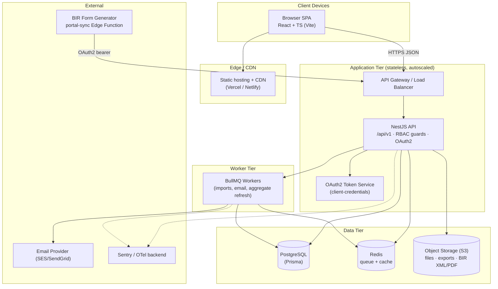

### 5.3 Cross-System Alignment

- **Shared enums & types.** The tax-classification enums (`VatClass`, `InputVATCategory`,
  `InputTaxAttribution`) live in a shared Zod/TypeScript definition so the Portal's import validation,
  manual-entry forms, and the integration contract stay byte-aligned with the BIR Generator.
- **Auth boundary.** The BIR Generator never receives Portal user credentials — it authenticates as a
  machine via OAuth2 client-credentials against the Portal's token service.
- **Artifacts.** Pushed-back eBIRForms XML and A4 PDFs are stored in the Portal's object storage and linked
  from the client profile.

---

## 6. Top Use Cases

### 6.1 Use-Case Summary

| ID | Use Case | Primary Actor(s) |
|---|---|---|
| UC-01 | Manage portal users & RBAC | Super Admin |
| UC-02 | Onboard / manage client profile | Manager, Accountant |
| UC-03 | Add sales/expense manually (regime-aware modal) | Accountant, Staff |
| UC-04 | Import sales/expenses (CSV/XLSX, classified) | Accountant, Staff |
| UC-05 | Export sales/expenses (CSV/XLSX) | Firm users, Client users |
| UC-06 | Create & send billing/invoice email | Manager, Accountant |
| UC-07 | Invite client to the Client Portal | Manager, Accountant |
| UC-08 | Manage Client Portal users | Client Owner |
| UC-09 | View dashboard & reports (incl. filed BIR forms) | Firm & Client users |
| UC-10 | View / run tax estimate | Accountant; Client (read-only) |
| UC-11 | Configure tax rules | Super Admin, Accountant |
| UC-12 | Authenticate / login (with MFA) | All users |
| UC-13 | Serve classified aggregates to the BIR Generator | BIR Form Generator (system) |
| UC-14 | Receive BIR filing push-back + Input Tax Asset | BIR Form Generator (system) |
| UC-15 | Manage integration credentials | Super Admin |

### 6.2 Use-Case Diagram

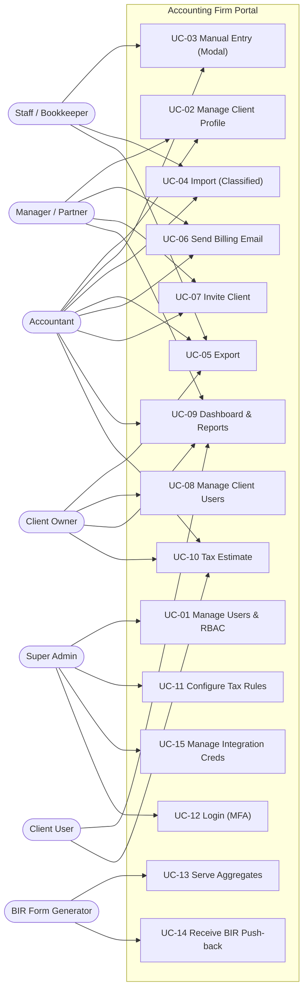

### 6.3 Detailed Use-Case Specifications

#### UC-04 — Import Sales/Expenses (CSV/XLSX, classified)

| Field | Detail |
|---|---|
| **Actor** | Accountant, Staff/Bookkeeper |
| **Goal** | Bulk-load a client's sales or expense records **with tax classification** from a spreadsheet. |
| **Preconditions** | User is authenticated and assigned to the client; a template file (incl. classification columns) is prepared. |
| **Main Flow** | 1. User opens the client's Sales/Expenses page and selects **Import**. 2. User uploads a CSV/XLSX file. 3. System parses and **validates** each row, including the tax-classification enums. 4. System shows a preview with valid rows and row-level errors. 5. User confirms; the system commits valid rows (net amount + classification) and records an **Import Batch**. |
| **Alternate Flows** | 3a. All rows fail → nothing committed; full error report shown. 5a. User cancels; nothing committed. |
| **Exceptions** | Unsupported file type → reject. Oversized file → async job; notify on completion. |
| **Postconditions** | Classified records are stored; an audit entry and import batch are created; data is available to aggregation (UC-13). |

#### UC-13 — Serve Classified Aggregates to the BIR Generator

| Field | Detail |
|---|---|
| **Actor** | BIR Form Generator (machine, via OAuth2) |
| **Goal** | Provide client profile and tax-classified aggregates to pre-fill a BIR filing. |
| **Preconditions** | A valid OAuth2 token with the needed scopes; the firm is authorized for the client. |
| **Main Flow** | 1. The Generator's connector calls a read endpoint (client, `vat-summary`, `percentage-tax-summary`, or `tax-computations`) with a bearer token. 2. The Portal validates the token and scope, enforces client visibility. 3. The Aggregation Service rolls classified transactions into the requested shape. 4. The Portal returns the JSON aggregate. |
| **Alternate Flows** | 3a. No data for the period → return the client profile / empty aggregate so the Generator can proceed manually. |
| **Exceptions** | Invalid/expired token → 401; missing scope → 403; client not visible → 403. |
| **Postconditions** | The Generator receives figures to pre-fill a filing; the call is logged. |

#### UC-14 — Receive BIR Filing Push-Back + Input Tax Asset

| Field | Detail |
|---|---|
| **Actor** | BIR Form Generator (machine, via OAuth2) |
| **Goal** | Record the finished BIR filing (status + XML + PDF) and the carried-forward Input Tax Asset. |
| **Preconditions** | Valid token with `bir-filings:write` (and `input-tax-asset:write`); the filing references a known client. |
| **Main Flow** | 1. The Generator `POST`s the filing artifact. 2. The Portal **upserts** a `BIRFiling` keyed by client + form + period, stores the XML/PDF, and returns a reference. 3. The Generator `POST`s the Input Tax Asset. 4. The Portal records an `InputTaxAsset` against the client. 5. Both appear on the client profile. |
| **Alternate Flows** | 2a. Re-send of the same period updates the existing record (idempotent). |
| **Exceptions** | Portal unreachable → the Generator marks the push pending and retries; idempotency prevents duplicates. |
| **Postconditions** | The client shows the filed BIR form (downloadable XML/PDF) and the booked Input Tax Asset. |

---

## 7. Class Diagram (Domain Model)

The domain model is presented as two connected views. **View A** covers identity, access, and tenancy.
**View B** covers financials, tax, and the BIR integration entities. The **`Client`** class bridges them.

### 7.1 View A — Identity, Access & Tenancy

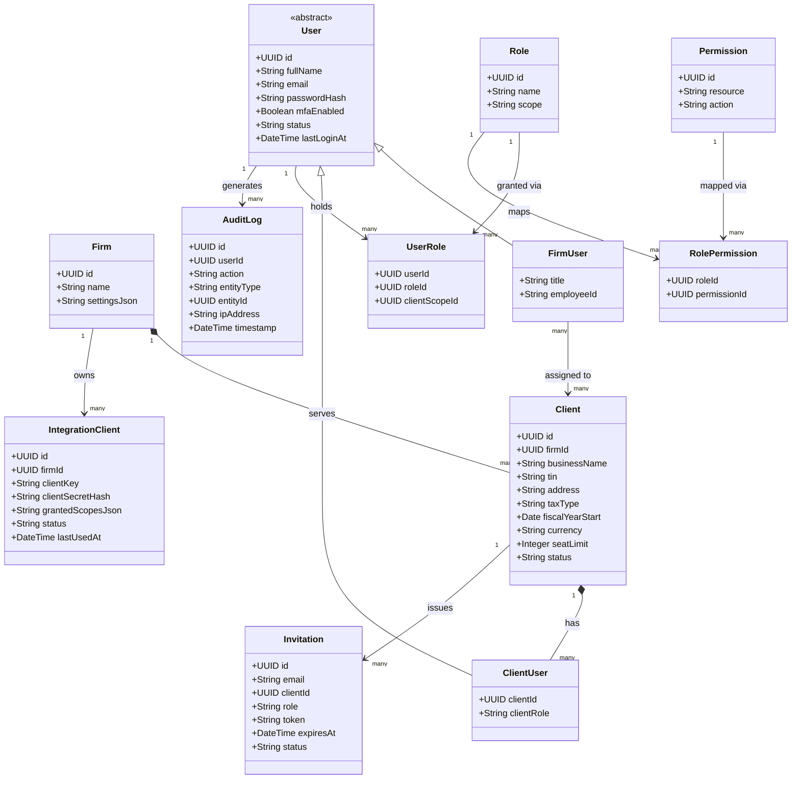

### 7.2 View B — Financials, Tax & BIR Integration

```mermaid
classDiagram
    class Client {
        +UUID id
        +String businessName
        +String currency
    }
    class SalesRecord {
        +UUID id
        +UUID clientId
        +Date txnDate
        +String referenceNo
        +String customer
        +UUID categoryId
        +String source
    }
    class IncomeTransaction {
        +Decimal netAmount
        +VatClass vatClass
        +Boolean saleToGovernment
        +Decimal outputVAT
        +Decimal creditableVATWithheld5pct
        +String atc
    }
    class ExpenseRecord {
        +UUID id
        +UUID clientId
        +Date txnDate
        +String referenceNo
        +String vendor
        +UUID categoryId
        +Boolean deductible
        +String source
    }
    class PurchaseTransaction {
        +Decimal netAmount
        +InputVATCategory inputVATCategory
        +Decimal inputVAT
        +Boolean isCapitalGood
        +Decimal capitalGoodAcquisitionCost
        +Integer estimatedUsefulLifeMonths
        +InputTaxAttribution inputTaxAttribution
    }
    class Category {
        +UUID id
        +UUID clientId
        +String type
        +String name
        +Boolean isDeductible
    }
    class TaxComputation {
        +UUID id
        +UUID clientId
        +String periodType
        +Date periodStart
        +Date periodEnd
        +Decimal grossIncome
        +Decimal totalDeductions
        +Decimal taxableIncome
        +Decimal grossTaxDue
        +Decimal taxCredits
        +Decimal netTaxPayable
    }
    class TaxRule {
        +UUID id
        +String taxType
        +String method
        +Date effectiveFrom
        +String configJson
    }
    class TaxBracket {
        +UUID id
        +UUID taxRuleId
        +Decimal lowerBound
        +Decimal upperBound
        +Decimal rate
        +Decimal baseTax
    }
    class Invoice {
        +UUID id
        +UUID clientId
        +String invoiceNo
        +Date issueDate
        +Date dueDate
        +Decimal total
        +String status
    }
    class InvoiceLineItem {
        +UUID id
        +UUID invoiceId
        +String description
        +Decimal amount
    }
    class EmailMessage {
        +UUID id
        +String type
        +String toEmail
        +UUID templateId
        +String status
        +DateTime sentAt
    }
    class BIRFiling {
        +UUID id
        +UUID clientId
        +String form
        +String periodType
        +Date periodStart
        +Date periodEnd
        +String status
        +String figuresJson
        +String xmlFilename
        +Text xmlBase64
        +String pdfUrl
    }
    class InputTaxAsset {
        +UUID id
        +UUID clientId
        +String sourceForm
        +Integer asOfYear
        +Integer asOfQuarter
        +Decimal excessInputTaxCarriedForward
        +Decimal deferredCapitalGoodsInputTax
        +Decimal totalInputTaxAsset
    }
    class VatClass {
        <<enum>>
        VATABLE_12
        ZERO_RATED
        EXEMPT
        NON_VAT
    }
    class InputVATCategory {
        <<enum>>
        DOMESTIC_PURCHASES
        SERVICES_NONRESIDENT
        IMPORTATION_GOODS
        OTHERS_WITH_INPUT_TAX
        DOMESTIC_NO_INPUT_TAX
        VAT_EXEMPT_IMPORTATION
        CAPITAL_GOODS_GT_1M
    }
    class InputTaxAttribution {
        <<enum>>
        VATABLE
        EXEMPT
        MIXED
    }

    SalesRecord <|-- IncomeTransaction
    ExpenseRecord <|-- PurchaseTransaction
    Client "1" *-- "many" IncomeTransaction : records
    Client "1" *-- "many" PurchaseTransaction : records
    Client "1" o-- "many" Category : defines
    Client "1" --> "many" TaxComputation : estimates
    Client "1" --> "many" Invoice : billed via
    Client "1" --> "many" BIRFiling : filed forms
    Client "1" --> "many" InputTaxAsset : booked carry-over
    TaxRule "1" *-- "many" TaxBracket : contains
    TaxRule "1" --> "many" TaxComputation : applied in
    Invoice "1" *-- "many" InvoiceLineItem : has
    Invoice "1" --> "many" EmailMessage : delivered by
    IncomeTransaction --> VatClass
    PurchaseTransaction --> InputVATCategory
    PurchaseTransaction --> InputTaxAttribution
```

### 7.3 Key Entity Notes

- **`SalesRecord` → `IncomeTransaction`** and **`ExpenseRecord` → `PurchaseTransaction`** add BIR
  tax-classification fields; amounts are held **net of VAT**, with VAT carried separately.
- **`TaxComputation`** is the Portal's **estimate** and the source for income-tax summary lines served to
  the Generator; the Generator recomputes and returns the filed figures as a **`BIRFiling`**.
- **`BIRFiling`** and **`InputTaxAsset`** are written by the integration (push-back), not by users.
- **`IntegrationClient`** holds the OAuth2 machine credential per firm; secrets are stored hashed.
- **RBAC join tables** keep roles/permissions fully data-driven.

---

## 8. Activity Diagrams

### 8.1 AD-01 — Import Sales / Expenses (with tax classification)

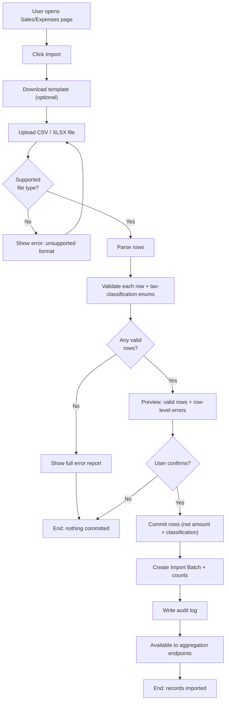

### 8.2 AD-02 — Add Sales / Expense Manually (Regime-Aware Modal)

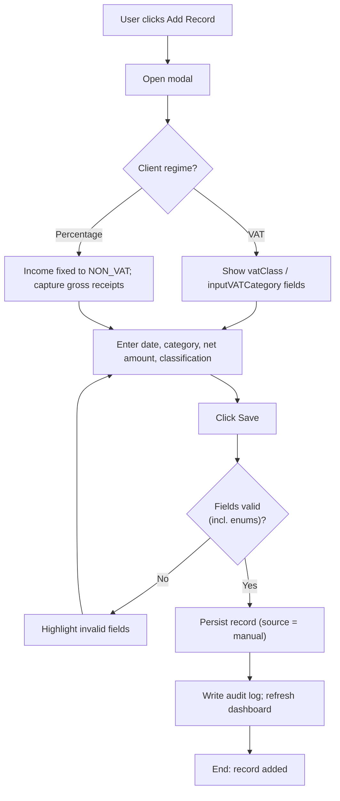

### 8.3 AD-03 — Invite Client to Portal & Onboarding

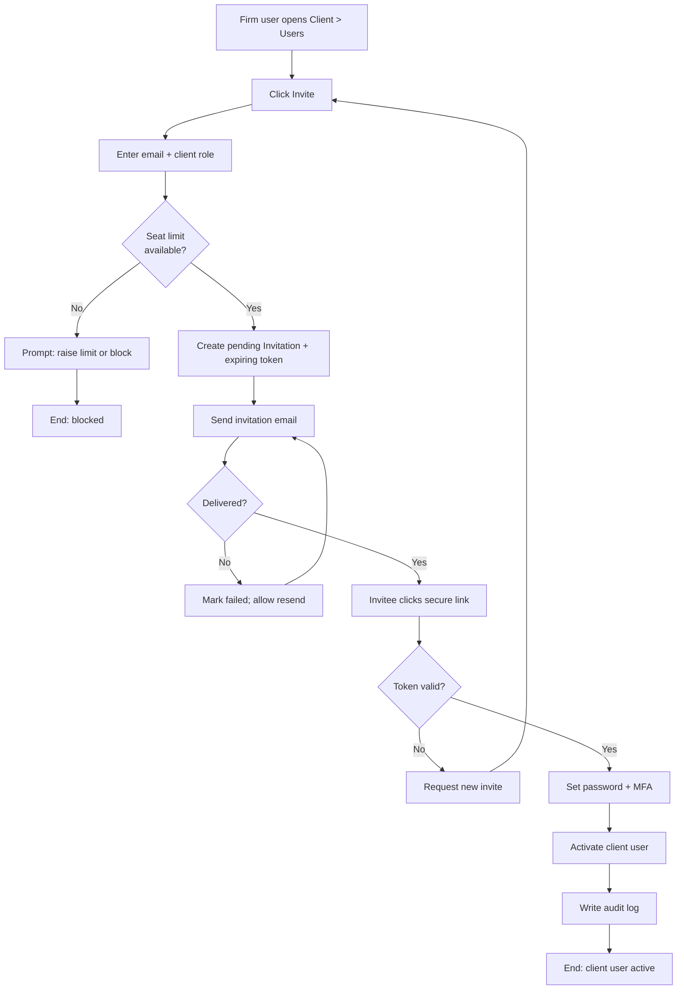

### 8.4 AD-04 — Create & Send Billing / Invoice Email

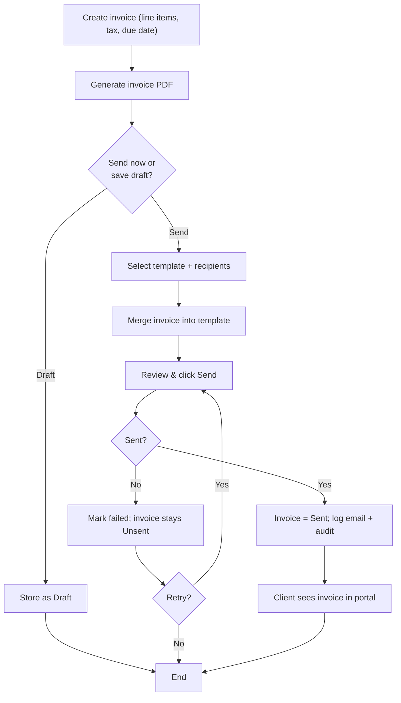

### 8.5 AD-05 — Tax Estimate (and its relationship to the filed figure)

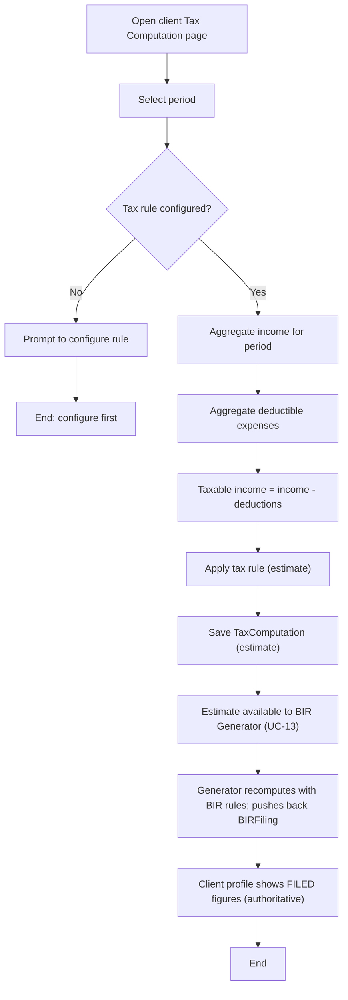

---

## 9. Import / Export Templates

The Portal provides downloadable template files whose headers match the definitions below. New columns for
BIR tax classification are marked **★**. Amounts are **net of VAT**.

### 9.1 Sales / Income Template

| Column | Required | Type | Notes |
|---|:---:|---|---|
| `Date` | ✔ | Date `YYYY-MM-DD` | Transaction date. |
| `ReferenceNo` | ✖ | Text | Invoice / OR number. |
| `Customer` | ✖ | Text | Payer / customer. |
| `Description` | ✔ | Text | What the income is for. |
| `Category` | ✔ | Text | Income category. |
| `NetAmount` ★ | ✔ | Decimal | Amount **exclusive of VAT**. |
| `VatClass` ★ | ✔ (VAT clients) | Enum | `VATABLE_12` / `ZERO_RATED` / `EXEMPT` / `NON_VAT`. |
| `OutputVAT` ★ | ✖ | Decimal | Advisory; Generator derives 12% × net. |
| `SaleToGovernment` ★ | ✖ | `Yes`/`No` | Overlay on a vatable sale. |
| `CreditableVATWithheld5pct` ★ | ✖ | Decimal | 5% withheld on government sales. |
| `ATC` ★ | ✖ | Text | Only if multiple percentage-tax streams. |
| `Currency` | ✖ | ISO | Defaults to client currency. |

### 9.2 Expenses / Purchases Template

| Column | Required | Type | Notes |
|---|:---:|---|---|
| `Date` | ✔ | Date `YYYY-MM-DD` | Transaction date. |
| `ReferenceNo` | ✖ | Text | Receipt / bill number. |
| `Vendor` | ✖ | Text | Supplier / payee. |
| `Description` | ✔ | Text | What the expense is for. |
| `Category` | ✔ | Text | Expense category. |
| `NetAmount` ★ | ✔ | Decimal | Amount **exclusive of VAT**. |
| `InputVATCategory` ★ | ✔ (VAT clients) | Enum | Items 44–49 / Schedule 1 category. |
| `InputVAT` ★ | ✖ | Decimal | Input VAT (0 for no-input categories). |
| `IsCapitalGood` ★ | ✖ | `Yes`/`No` | Capital acquisition flag. |
| `CapitalGoodAcquisitionCost` ★ | cond. | Decimal | Required if `CAPITAL_GOODS_GT_1M`. |
| `EstimatedUsefulLifeMonths` ★ | cond. | Integer | Required if `CAPITAL_GOODS_GT_1M`. |
| `InputTaxAttribution` ★ | ✖ | Enum | `VATABLE` / `EXEMPT` / `MIXED`. |
| `Deductible` | ✖ | `Yes`/`No` | Income-tax deductibility (default from category). |
| `Currency` | ✖ | ISO | Defaults to client currency. |

### 9.3 Validation Rules (applied on import)

1. **Required fields** present (`Date`, `Description`, `Category`, `NetAmount`; plus `VatClass` /
   `InputVATCategory` for VAT clients).
2. **Enums** must match the allowed values exactly (case-insensitive); unknown values are flagged.
3. **Conditional fields** — `CapitalGoodAcquisitionCost` and `EstimatedUsefulLifeMonths` are required when
   `InputVATCategory = CAPITAL_GOODS_GT_1M`.
4. **Amounts** are non-negative decimals; separators stripped.
5. **Duplicate detection** flags rows matching *(Date, ReferenceNo, NetAmount)*.
6. Rows failing validation are reported with **row number, field, message**; only valid rows commit.

### 9.4 Export Behaviour

- Export produces the **same columns** (incl. classification) for a client, record type, and period.
- Formats: **CSV** (UTF-8) and **XLSX** (typed cells, header styling).

---

## 10. Tax Computation Framework

> **Scope reminder.** This framework produces the Portal's **management estimate**. The **authoritative BIR
> computation** (TRAIN tables, 8%, MCIT, OSD, NOLCO, VAT/percentage) is owned by the **BIR Form Generator**,
> which recomputes imported figures and pushes back the filed result (§11). All rates below are
> **configuration** the firm sets and validates.

### 10.1 Design Goals

- **Configurable, not hard-coded** — multiple tax types and methods via data (`TaxRule` / `TaxBracket`).
- **Pluggable methods** — graduated brackets, flat rate, percentage, or simplified (a *Strategy* pattern).
- **Period-aware** — monthly, quarterly, or annual.
- **Reconcilable** — the estimate feeds the Generator, which reconciles it against BIR rules.

### 10.2 Computation Pipeline


### 10.3 Method Strategies

| Method | Formula (conceptual) |
|---|---|
| **Graduated** | `tax = baseTax + (taxableIncome − lowerBound) × rate` for the matched bracket. |
| **Flat** | `tax = taxableIncome × flatRate`. |
| **Percentage** | `tax = grossIncome × percentageRate` (on gross). |
| **Simplified** | `tax = (grossIncome − allowance) × simplifiedRate` per `configJson`. |

### 10.4 Configuration & Outputs

- **`TaxRule`**: `taxType`, `method` (`graduated`/`flat`/`percentage`/`simplified`), `effectiveFrom/To`,
  `configJson` (standard-deduction %, thresholds, flat rate); **`TaxBracket[]`** for graduated.
- **`TaxComputation`** output: grossIncome, totalDeductions, taxableIncome, grossTaxDue, taxCredits,
  netTaxPayable, period — the exact fields the Generator consumes for income-tax summary lines (§11).

### 10.5 Worked Example *(illustrative — configure to current law)*

Quarter with **Gross Income = ₱500,000**, **Deductible Expenses = ₱200,000**, graduated method:

| Bracket | Lower | Upper | Rate | Base Tax |
|---|---|---|---|---|
| 1 | 0 | 250,000 | 0% | 0 |
| 2 | 250,000 | 400,000 | 15% | 0 |
| 3 | 400,000 | 800,000 | 20% | 22,500 |

Taxable income = 500,000 − 200,000 = **₱300,000** → Bracket 2 → tax = (300,000 − 250,000) × 15% =
**₱7,500** (estimate). The Generator later recomputes under BIR rules and returns the filed figure.

---

## 11. BIR Form Generator Integration

This section details the connection between the Portal and the external **BIR Form Generator**. It implements
the Generator's §7 build contract from the Portal side.

### 11.1 Responsibility Split

| Capability | Owner |
|---|---|
| Client profiles | **Portal** |
| Per-transaction income & purchase records **+ tax classification** | **Portal** |
| Aggregation endpoints — VAT summary, percentage receipts, income-tax summary | **Portal** |
| Storing the filing artifact **and Input Tax Asset** on the client record | **Portal** (values pushed by the Generator) |
| BIR form layout, field-level filling, form-specific rules | **BIR Form Generator** |
| Taxpayer registration — tax types + percentage-tax **ATC & rate** (from the COR) | **BIR Form Generator** |
| Period carry-overs — excess input VAT, capital-goods (>₱1M) amortization | **BIR Form Generator** |
| eBIRForms XML export & A4 PDF | **BIR Form Generator** |

### 11.2 Architecture & Trust Boundary

The Generator is a browser SPA, so Portal credentials never live in client code. Its `portal-sync` Edge
Function holds the OAuth client secret and calls the Portal's server-to-server API.

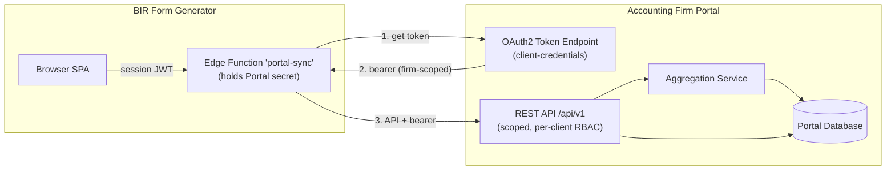

### 11.3 Data Contract (Portal-Side Entities)

The Portal extends its records and adds two write-target entities (full fields in §7.2):

- **`IncomeTransaction`** (extends `SalesRecord`): `netAmount`, `vatClass`, `saleToGovernment`, `outputVAT`,
  `creditableVATWithheld5pct`, `atc`.
- **`PurchaseTransaction`** (extends `ExpenseRecord`): `netAmount`, `inputVATCategory`, `inputVAT`,
  `isCapitalGood`, `capitalGoodAcquisitionCost`, `estimatedUsefulLifeMonths`, `inputTaxAttribution`.
- **`BIRFiling`** and **`InputTaxAsset`**: written by push-back.

Enums (verbatim): `VatClass` = `VATABLE_12 · ZERO_RATED · EXEMPT · NON_VAT`; `InputVATCategory` =
`DOMESTIC_PURCHASES · SERVICES_NONRESIDENT · IMPORTATION_GOODS · OTHERS_WITH_INPUT_TAX ·
DOMESTIC_NO_INPUT_TAX · VAT_EXEMPT_IMPORTATION · CAPITAL_GOODS_GT_1M`; `InputTaxAttribution` =
`VATABLE · EXEMPT · MIXED`.

### 11.4 Endpoints the Portal Exposes (Portal → Generator)

Base `{PORTAL_BASE}/api/v1`; OAuth2 bearer; per-client RBAC enforced.

| Method & Path | Purpose | Scope |
|---|---|---|
| `GET /clients?assignedTo=me&query=` | List importable clients | `clients:read` |
| `GET /clients/{clientId}` | Client profile → Taxpayer | `clients:read` |
| `GET /clients/{clientId}/tax-computations?periodType=&periodStart=&periodEnd=` | Income-tax summary | `tax-computations:read` |
| `GET /clients/{clientId}/vat-summary?year=&quarter=` | 2550Q roll-up | `vat-summary:read` |
| `GET /clients/{clientId}/percentage-tax-summary?year=&quarter=` | 2551Q gross receipts | `percentage-tax-summary:read` |
| `GET /clients/{clientId}/income-transactions?from=&to=` | Raw classified income rows | `transactions:read` |
| `GET /clients/{clientId}/purchase-transactions?from=&to=` | Raw classified purchase rows | `transactions:read` |

**`vat-summary` response (net of VAT; government sales included in `vatable` + memo):**

```json
{
  "client": { "id": "cl_123", "tin": "471522378", "vatRegistered": true },
  "period": { "year": 2026, "quarter": 1, "start": "2026-01-01", "end": "2026-03-31" },
  "sales": {
    "vatable":   { "net": 400000.00, "outputVAT": 48000.00 },
    "zeroRated": { "net": 0.00 },
    "exempt":    { "net": 0.00 },
    "governmentSalesMemo": { "net": 100000.00, "creditableVATWithheld5pct": 5000.00 }
  },
  "purchases": {
    "domesticPurchases":   { "net": 300000.00, "inputVAT": 36000.00 },
    "servicesNonResident": { "net": 0.00, "inputVAT": 0.00 },
    "importationGoods":    { "net": 0.00, "inputVAT": 0.00 },
    "othersWithInputTax":  { "net": 0.00, "inputVAT": 0.00 },
    "domesticNoInputTax":  { "net": 0.00 },
    "vatExemptImportation":{ "net": 0.00 },
    "capitalGoodsGT1M": { "items": [ { "acquiredOn": "2026-02-10", "cost": 1500000.00, "inputVAT": 180000.00, "usefulLifeMonths": 60 } ] }
  },
  "exemptInputTax": { "directlyAttributable": 0.00, "commonNotDirectlyAttributable": 0.00 },
  "otherCredits": { "creditableVATWithheld": 5000.00, "advanceVATPayments": 0.00 }
}
```

**`percentage-tax-summary` response (amounts only; ATC & rate owned by the Generator):**

```json
{
  "client": { "id": "cl_123", "tin": "471522378", "vatRegistered": false },
  "period": { "year": 2026, "quarter": 1, "start": "2026-01-01", "end": "2026-03-31" },
  "grossReceipts": 500000.00,
  "byAtc": [ { "atc": "PT010", "grossReceipts": 500000.00 } ]
}
```

> **Aggregation rules:** `outputVAT` is advisory (Generator derives 12% × net); `creditableVATWithheld` is a
> single total that **already includes** the government 5% memo (no double count); `exemptInputTax` returns
> the two Schedule-2 components **un-apportioned**; capital goods > ₱1M are raw items for Schedule 1, never
> in Items 44–49.

### 11.5 Endpoints the Portal Accepts (Generator → Portal)

| Method & Path | Purpose | Scope |
|---|---|---|
| `POST /clients/{clientId}/bir-filings` | Create the filing artifact (idempotent by client + form + period) | `bir-filings:write` |
| `PUT /clients/{clientId}/bir-filings/{ref}` | Re-sync the same period | `bir-filings:write` |
| `POST /clients/{clientId}/input-tax-asset` | Book the Input Tax Asset carry-over | `input-tax-asset:write` |
| `GET /clients/{clientId}/bir-filings` | Reconcile stored filings | `bir-filings:read` |

**`bir-filings` push-back payload (excess-input quarter example):**

```json
{
  "form": "2550Q",
  "periodType": "quarter",
  "periodStart": "2026-01-01",
  "periodEnd": "2026-03-31",
  "status": "filed",
  "figures": { "outputVAT": 48000.00, "allowableInputVAT": 60000.00, "netVATPayable": -12000.00, "amountPayable": 0.00 },
  "xmlFilename": "471522378000002550Q2026Q1.xml",
  "xmlBase64": "<base64 of the eBIRForms XML>",
  "pdfUrl": "https://<signed-url-to-A4-pdf>"
}
```

**`input-tax-asset` handoff payload:**

```json
{
  "sourceForm": "2550Q",
  "asOfPeriod": { "year": 2026, "quarter": 1 },
  "excessInputTaxCarriedForward": 12000.00,
  "deferredCapitalGoodsInputTax": 3000.00,
  "totalInputTaxAsset": 15000.00,
  "computedAt": "2026-04-20T09:00:00Z"
}
```

### 11.6 Aggregation — Classified Transactions to Form Lines

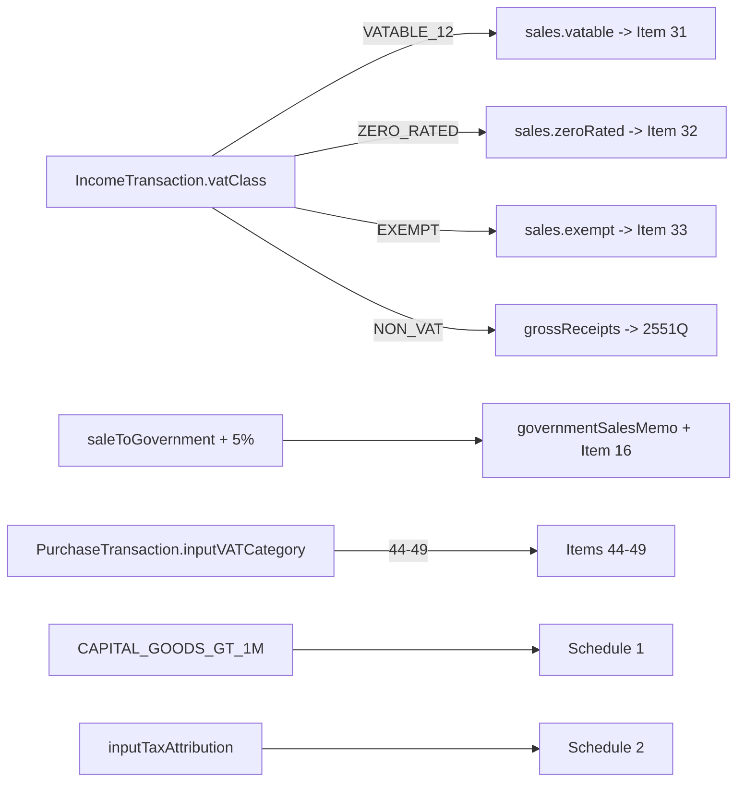

### 11.7 End-to-End Sequence (Portal Perspective)

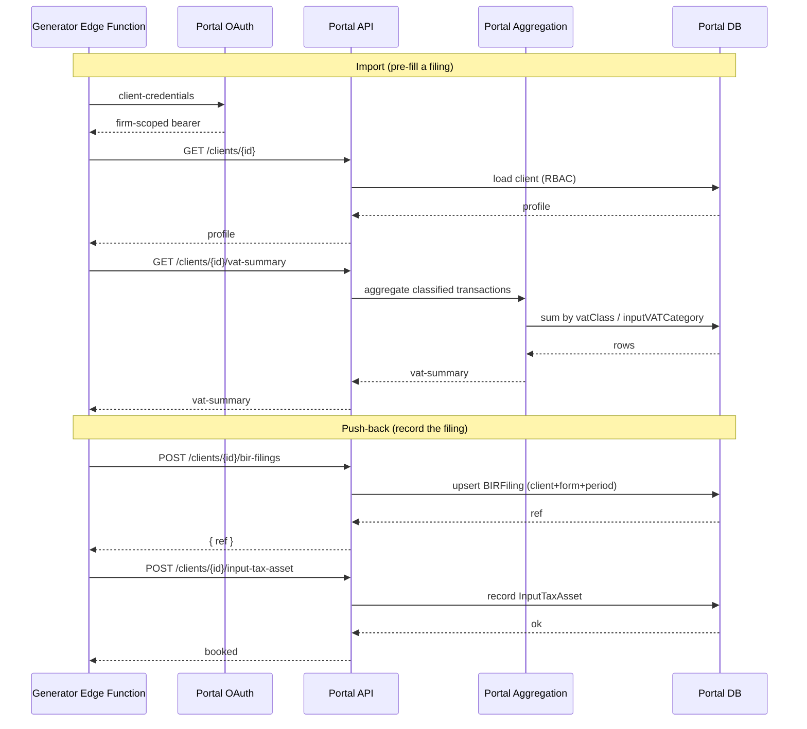

### 11.8 Sync Semantics & Portal Responsibilities

| Concern | Portal responsibility |
|---|---|
| **Idempotency** | Push-back is an **upsert** keyed by `client + form + period`; never duplicate. |
| **Partial data** | If no aggregate exists, still serve the client profile so the Generator can pre-fill background. |
| **Reconciliation** | Return figures as inputs; the Generator recomputes — the Portal's numbers are not the filed truth. |
| **Carry-over ownership** | Only **record** the Input Tax Asset handed back; do not compute carry-over/amortization. |
| **Failure** | Return clear, retryable errors; remain consistent under retries (idempotency). |
| **Auth expiry** | Reject expired tokens cleanly so the connector can refresh. |
| **Least privilege** | Honour scope boundaries; enforce per-client visibility regardless of token scope. |

### 11.9 Forms Covered

| Form | Import source | Status |
|---|---|---|
| 2550Q (VAT) | `vat-summary` (+ Generator carry-over) | ✅ in scope |
| 2551Q (Percentage) | `percentage-tax-summary` (+ Generator ATC/rate) | ✅ in scope |
| 1701 / 1701A / 1701Q / 1702RT / 1702Q (Income tax) | `tax-computations` (+ manual NOLCO/MCIT/method) | ✅ in scope |
| 2307 / 2316 (Certificates) | Standalone in Generator | ✖ out of API scope |

---

## 12. Appendices

### 12.1 Glossary

| Term | Definition |
|---|---|
| **RBAC** | Role-Based Access Control — permissions granted through roles. |
| **Tenant / Client** | An isolated data partition; one client organization. |
| **Seat** | A user slot within a client's Client-Portal allocation (min. 3). |
| **Aggregation** | Rolling classified transactions into BIR form shapes. |
| **BIR / eBIRForms** | Bureau of Internal Revenue; its electronic-forms package consuming the XML. |
| **VAT / Percentage Tax** | Alternative Philippine business-tax regimes; a client is one or the other. |
| **ATC** | Alphanumeric Tax Code selecting the percentage-tax rate (owned by the Generator). |
| **Input Tax Asset** | Carried-forward creditable input VAT booked as an asset. |
| **OAuth2 client-credentials** | Server-to-server auth issuing a scoped bearer token. |

### 12.2 Assumptions

1. A single accounting **firm** operates the portal; `firmId` is recorded to allow future multi-firm growth.
2. Client-side data entry is **off by default** and enabled per firm policy.
3. Email delivery is via an external provider; the portal stores logs and statuses.
4. Currency is configurable per client; **BIR figures are filed in PHP**.
5. The BIR Form Generator authenticates as a machine (OAuth2); it never holds Portal user credentials.

### 12.3 Out of Scope (this version)

- BIR form layout, eBIRForms XML/PDF, and authoritative BIR tax math (owned by the BIR Form Generator).
- Direct e-filing to the BIR; payment processing.
- Full double-entry general ledger and bank reconciliation.
- Native mobile apps (the web UI is responsive).

---

*End of document.*
